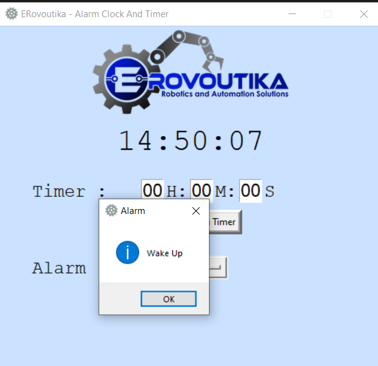

Features

Our digital clock is simple. It has a 24-hr format clock for reading time, a countdown timer that inputs hour and alarm. The Erovoutika logo is included as well.

When the countdown timer is finished. An alarm sound would play and a message box would pop up saying “Time’s up”.

To set the time for alarm you need to pick a number from a drop list. 00 to 59 for minutes and 00 to 24 for hours. When the alarm time is reached, an alarm sound will play and a message box will pop up saying “Wake Up”

